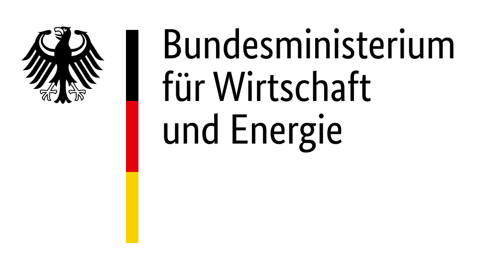

# Gesamtstruktur des deutschen Nichtwohngebäudebestands --- German non-residential building stock structure
Im [ENOB:dataNWG](https://datanwg.de/home/aktuelles/) Projekt wurden erstmalig die Strukturen des deutschen Nichtwohngebäude (NWG) Bestandes, die bisher in keiner amtlichen Statistik vollständig abgebildet sind, sowie Stand und Dynamik der energetischen Modernisierung der Nichtwohngebäude erhoben.

In der deutschen [Nichtwohngebäudetypologie](https://github.com/IWUGERMANY/Nichtwohngebaeude-Typologie-Deutschland) sind beispielsweise die wichtigsten Eigenschaften des konditionierten, GEG relevanten, deutschen Nichtwohngebäudebestandes (NWGB), nach der Gebäudehauptkategorie und drei groben Baualtersklassen gegliedert, als Open Data Packet veröffentlicht. Die Gliederung des NWGB anhand der Gebäudeunterkategorien fehlte bisher (November 2024). Ebenso die Struktur der Nichtwohngebäude (NWG) die nur gering oder gar nicht konditioniert sind. Die hier veröffentlichen Tabellen präsentiert daher die konditionierten NWG nach deren Unterkategorien (pos01.01.05 uk_geb) sowie die gering und nicht konditionierten NWG nach Gebäudefunktion (pos01.01.03 Geb-Funktion).

Die präsentieren Tabellen wurden im Bericht "Gesamtstruktur des deutschen Nichtwohngebäudebestands - GEG-relevante Nichtwohngebäude, differenziert nach Unterkategorien, gering bzw. nicht konditionierten Gebäuden" veröffentlicht und sind online unter www.sfasdfsdsfdfsd.de verfügbar.

---
## Zitieren --- How to cite
- Bischof, Julian, Hörner, Michael; Rodenfels, Markus (2024): Gesamtstruktur des deutschen Nichtwohngebäudebestands - GEG-relevante Nichtwohngebäude, differenziert nach Unterkategorien, gering bzw. nicht konditionierten Gebäuden. Forschungsdatenbank Nichtwohngebäude ENOB:dataNWG. In IWU 2024, online verfügbar unter: www.sfasdfsdsfdfsd.de. DOI safsdfasdfasdfd.
---

The German non-residential building stock structure is a result of the 'ENOB:DataNWG Forschungsdatenbank Nichtwohngebäude' (www.datanwg.de) project at Institut Wohnen und Umwelt (IWU), Darmstadt.

   

  

<b>ENOB:DataNWG<b>
<b>Funding code:</b>  Fkz.: 03ET1315  
<b>Project duration:</b>  01.12.2015 until 31.05.2021

<b>Funded by:</b> 

   

 
in accordance with the parliamentary resolution of the German Parliament.

Total number of individual page views: 
